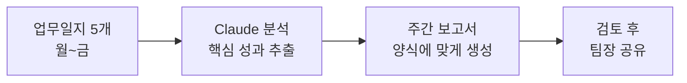
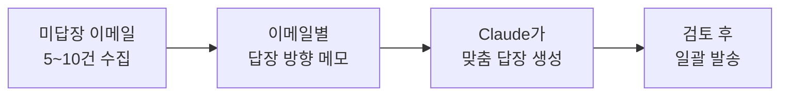
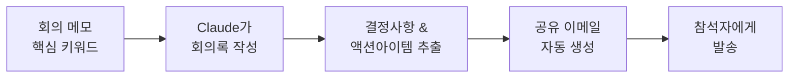
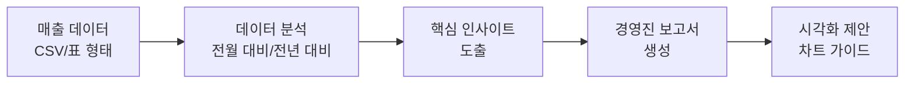
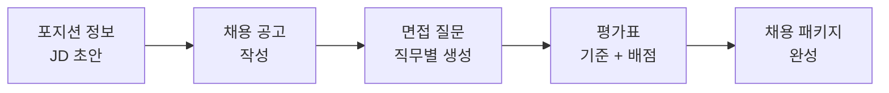
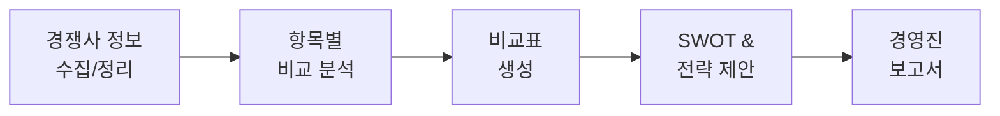
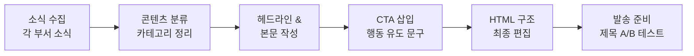
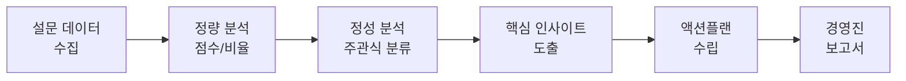
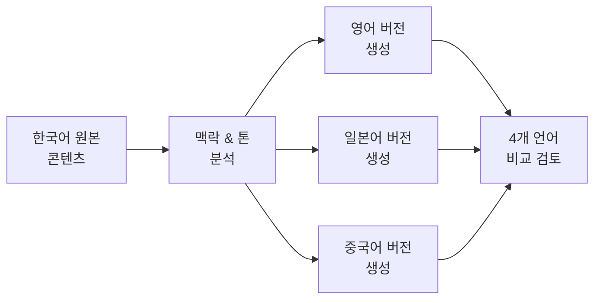
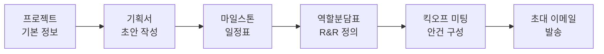

# 워크플로우 레시피

> 단순 질문-답변을 넘어, 여러 단계를 연결하는 **자동화 워크플로우**를 만들어 보세요. 반복 업무를 파이프라인으로 구성하면 매번 같은 품질의 결과물을 빠르게 얻을 수 있습니다.

::: tip 이 페이지 활용법
각 레시피의 **실전 프롬프트**를 복사해서 바로 사용할 수 있습니다. 상황에 맞게 `[괄호]` 안의 내용만 교체하세요.
:::

## 레시피 한눈에 보기

| # | 레시피 | 난이도 | 소요 시간 | 핵심 산출물 |
|---|--------|--------|-----------|-------------|
| 1 | 주간 보고서 자동 생성 | ⭐ 초급 | 설정 3분, 실행 2분 | 주간 보고서 |
| 2 | 이메일 배치 처리 | ⭐ 초급 | 설정 2분, 실행 3분 | 답장 초안 5~10개 |
| 3 | 회의 → 회의록 → 공유 이메일 | ⭐⭐ 중급 | 설정 5분, 실행 5분 | 회의록 + 이메일 |
| 4 | 매출 데이터 → 분석 → 보고서 | ⭐⭐ 중급 | 설정 5분, 실행 5분 | 분석 보고서 |
| 5 | 채용 프로세스 자동화 | ⭐⭐ 중급 | 설정 10분, 실행 8분 | 공고 + 질문 + 평가표 |
| 6 | 경쟁사 분석 자동화 | ⭐⭐ 중급 | 설정 5분, 실행 10분 | 비교표 + 보고서 |
| 7 | 월간 뉴스레터 자동 생성 | ⭐⭐⭐ 고급 | 설정 10분, 실행 15분 | 뉴스레터 원고 |
| 8 | 고객 피드백 분석 파이프라인 | ⭐⭐⭐ 고급 | 설정 10분, 실행 15분 | 인사이트 + 액션플랜 |
| 9 | 다국어 콘텐츠 제작 | ⭐⭐⭐ 고급 | 설정 5분, 실행 20분 | 4개 언어 콘텐츠 |
| 10 | 프로젝트 킥오프 패키지 | ⭐⭐⭐ 고급 | 설정 10분, 실행 20분 | 기획서 + 일정 + 역할 + 메일 |

---

## 1. 주간 보고서 자동 생성 ⭐ 초급

> 월~금 업무일지 5개를 붙여넣으면, 팀 양식에 맞는 주간 보고서가 완성됩니다.

**소요 시간:** 설정 3분, 실행 2분

### 상황 설명

매주 금요일 오후, 한 주간의 업무일지를 모아 주간 보고서를 작성해야 합니다. 업무일지 5개를 일일이 읽고 요약하는 데 30분 이상 걸리던 작업을 2분으로 단축합니다.

### 워크플로우



### 단계별 진행

1. **월~금 업무일지 5개**를 복사합니다
2. 아래 프롬프트에 붙여넣습니다
3. 생성된 보고서를 검토하고, 필요시 수정 요청합니다
4. 완성본을 팀장님께 공유합니다

### 실전 프롬프트

```text
이번 주(3/9~3/13) 업무일지 5개를 기반으로 주간 보고서를 작성해줘.

[업무일지 월요일]
- 오전: A사 미팅, 요구사항 정리
- 오후: 기획서 초안 작성

[업무일지 화요일]
- 오전: B프로젝트 개발 리뷰
- 오후: 고객 VOC 분석

[업무일지 수요일]
- 오전: 팀 회의, 주간 목표 점검
- 오후: 제안서 수정 및 발송

[업무일지 목요일]
- 오전: C사 온라인 미팅
- 오후: 데이터 분석 보고서 작성

[업무일지 금요일]
- 오전: 신규 기능 테스트
- 오후: 주간 마감 정리

보고서 양식:
1. 금주 핵심 성과 (3가지)
2. 업무 상세 내역 (일별 정리)
3. 이슈 및 대응 현황
4. 차주 계획 (우선순위별)

톤: 간결하고 성과 중심으로
```

### 예상 결과물

- 핵심 성과 3가지가 강조된 주간 보고서
- 일별 업무가 카테고리별로 재분류된 상세 내역
- 이슈 사항과 대응 방안이 정리된 테이블
- 우선순위가 매겨진 차주 계획

---

## 2. 이메일 배치 처리 ⭐ 초급

> 답장해야 할 이메일 여러 건을 한 번에 처리합니다. 각 이메일의 맥락과 답장 방향만 알려주면 됩니다.

**소요 시간:** 설정 2분, 실행 3분

### 상황 설명

월요일 아침, 주말 동안 쌓인 이메일이 10통. 하나하나 답장을 쓰면 1시간이 넘지만, Claude에게 한 번에 맡기면 10분이면 충분합니다.

### 워크플로우



### 단계별 진행

1. 답장이 필요한 이메일을 모아 복사합니다
2. 각 이메일에 대한 **답장 방향**을 간단히 메모합니다
3. 프롬프트에 함께 입력합니다
4. 생성된 답장을 각각 검토하고 발송합니다

### 실전 프롬프트

```text
아래 5개 이메일에 대한 답장을 각각 작성해줘.
내 이름은 [김민수], 직함은 [마케팅팀 대리]야.

[이메일 1]
보낸 사람: 박과장 (거래처 A사)
내용: 다음 주 미팅 일정 잡고 싶다
→ 답장 방향: 화요일 오후 2시 제안, 장소는 우리 사무실

[이메일 2]
보낸 사람: 이대리 (사내)
내용: 지난번 요청한 자료 언제 받을 수 있는지
→ 답장 방향: 이번 주 금요일까지 전달 예정, 양해 부탁

[이메일 3]
보낸 사람: 김부장 (본사)
내용: 신규 프로젝트 참여 가능한지 확인
→ 답장 방향: 관심 있으나 현재 일정상 4월부터 가능

[이메일 4]
보낸 사람: 최사원 (후배)
내용: 보고서 양식 문의
→ 답장 방향: 공유 드라이브 링크 안내, 작성 팁 간단히

[이메일 5]
보낸 사람: 외부 세미나 초청
내용: 디지털 마케팅 세미나 참석 여부
→ 답장 방향: 정중히 거절, 다음 기회에

각 답장의 톤:
- 사내: 편하지만 존중하는 톤
- 거래처: 비즈니스 격식체
- 외부: 정중한 거절 톤
```

### 예상 결과물

- 이메일 5건에 대한 개별 답장 초안
- 각 상대방과의 관계에 맞는 적절한 톤
- 구체적인 일정/정보가 포함된 실용적 답장

---

## 3. 회의 → 회의록 → 공유 이메일 파이프라인 ⭐⭐ 중급

> 회의 내용을 입력하면 정리된 회의록과 참석자 공유용 이메일까지 한 번에 생성합니다.

**소요 시간:** 설정 5분, 실행 5분

### 상황 설명

1시간 회의가 끝난 직후, 회의록을 정리하고 참석자에게 공유 메일을 보내야 합니다. 메모만 남겨두면 Claude가 체계적인 회의록과 후속 조치 포함 이메일을 만들어 줍니다.

### 워크플로우



### 단계별 진행

1. 회의 중 **핵심 키워드와 결정사항**을 간단히 메모합니다
2. 프롬프트 1단계: 메모를 바탕으로 회의록을 생성합니다
3. 프롬프트 2단계: 회의록을 기반으로 공유 이메일을 생성합니다
4. 회의록은 사내 시스템에, 이메일은 참석자에게 발송합니다

### 실전 프롬프트

```text
아래 회의 메모를 바탕으로 2가지를 만들어줘.

[회의 정보]
- 회의명: [2분기 마케팅 전략 회의]
- 일시: [2026년 3월 13일 (금) 14:00~15:30]
- 참석자: [김팀장, 박대리, 이사원, 최과장(디자인팀)]
- 장소: [3층 회의실 A]

[회의 메모]
- 2분기 예산 전년 대비 15% 증가 확정
- SNS 마케팅 강화 → 인스타 릴스 주 3회 발행
- 신규 브랜드 캠페인 4월 런칭 목표
- 디자인팀 협업: 캠페인 시안 3월 말까지 필요
- 박대리가 인플루언서 리스트 정리 (다음 주 수요일까지)
- 이사원이 경쟁사 SNS 분석 보고 (다음 주 금요일까지)
- 예산 배분안은 김팀장이 다음 회의 때 공유

[결과물 1: 회의록]
양식:
1. 회의 개요 (일시, 참석자, 안건)
2. 논의 내용 (안건별 정리)
3. 결정 사항 (번호 매기기)
4. 액션 아이템 (담당자 + 기한을 표로 정리)
5. 다음 회의 안건

[결과물 2: 공유 이메일]
- 수신: 참석자 전원
- 내용: 회의록 요약 + 각자 액션 아이템 리마인드
- 톤: 친근하지만 명확하게
```

### 예상 결과물

- 안건별로 구조화된 회의록
- 담당자/기한이 명시된 액션 아이템 테이블
- 참석자 각자의 할 일이 강조된 공유 이메일

---

## 4. 매출 데이터 → 분석 → 보고서 자동화 ⭐⭐ 중급

> 매출 데이터를 붙여넣으면 트렌드 분석과 경영진 보고용 요약 보고서를 자동 생성합니다.

**소요 시간:** 설정 5분, 실행 5분

### 상황 설명

매월 초, 지난달 매출 데이터를 정리해 경영진에게 보고해야 합니다. 엑셀에서 숫자만 뽑아오면, 분석과 인사이트 도출, 보고서 작성까지 자동화할 수 있습니다.

### 워크플로우



### 단계별 진행

1. 엑셀이나 사내 시스템에서 **매출 데이터를 표 형태**로 복사합니다
2. 전월/전년 동기 데이터도 함께 제공하면 비교 분석이 가능합니다
3. 프롬프트에 분석 관점과 보고서 양식을 지정합니다
4. 생성된 보고서에 실제 차트를 추가해 완성합니다

### 실전 프롬프트

```text
아래 매출 데이터를 분석하고 경영진 보고서를 작성해줘.

[2월 매출 데이터]
| 제품군 | 1월 매출 | 2월 매출 | 전년 2월 |
|--------|----------|----------|----------|
| A제품  | 5.2억    | 5.8억    | 4.9억    |
| B제품  | 3.1억    | 2.7억    | 3.3억    |
| C제품  | 1.8억    | 2.4억    | 1.5억    |
| D제품  | 4.5억    | 4.6억    | 4.2억    |

[분석 요청]
1. 전월 대비 증감 분석 (%, 금액)
2. 전년 동기 대비 성장률
3. 제품군별 성과 평가
4. 주목할 트렌드 3가지
5. 리스크 요인과 대응 방안

[보고서 양식]
- 1페이지 요약 (Executive Summary)
- 상세 분석 (제품군별)
- 향후 전망 및 제안
- 추천 차트 종류와 데이터 포인트 안내

톤: 데이터 기반, 객관적, 경영진이 빠르게 파악할 수 있게
```

### 예상 결과물

- 전월/전년 대비 증감률이 계산된 분석표
- 제품군별 성과 하이라이트와 우려 사항
- 경영진 1페이지 요약 보고서
- 엑셀에서 만들 차트 종류와 데이터 범위 가이드

---

## 5. 채용 프로세스 자동화 ⭐⭐ 중급

> 채용 포지션 정보를 입력하면 채용 공고, 면접 질문, 평가표까지 일괄 생성합니다.

**소요 시간:** 설정 10분, 실행 8분

### 상황 설명

새로운 포지션 채용이 확정되었습니다. 채용 공고 작성, 면접 질문 준비, 평가 기준 수립까지 보통 3~5일 걸리는 작업을 한 번에 처리합니다.

### 워크플로우



### 단계별 진행

1. **포지션의 핵심 정보**를 정리합니다 (직무, 자격요건, 우대사항)
2. 1단계: 매력적인 채용 공고를 생성합니다
3. 2단계: 직무 역량을 평가할 면접 질문을 생성합니다
4. 3단계: 면접관용 평가표를 생성합니다
5. 각 산출물을 HR팀과 현업 부서에 공유합니다

### 실전 프롬프트

```text
아래 포지션 정보로 채용 프로세스 3종 세트를 만들어줘.

[포지션 정보]
- 직무: [디지털 마케팅 매니저]
- 소속: [마케팅본부 퍼포먼스팀]
- 경력: [5~8년차]
- 핵심 업무:
  - 디지털 광고 캠페인 기획/운영 (Google, Meta, 네이버)
  - 데이터 기반 성과 분석 및 최적화
  - 마케팅 예산 관리 (월 5억 규모)
  - 대행사 관리 및 협업
- 필수 자격:
  - 퍼포먼스 마케팅 경력 5년 이상
  - GA4, SQL 활용 가능
  - 광고 플랫폼 자격증 보유
- 우대 사항:
  - 이커머스 업종 경험
  - 팀 리딩 경험
  - 영어 커뮤니케이션 가능

[결과물 1: 채용 공고]
- 회사 매력 포인트 강조
- 성장 기회, 복지, 팀 문화 포함
- MZ세대가 관심 가질 만한 톤

[결과물 2: 면접 질문 15개]
- 직무 역량 질문 5개 (실무 경험 중심)
- 문제 해결력 질문 5개 (상황 시나리오)
- 컬처핏 질문 5개 (가치관, 협업 스타일)
- 각 질문에 "좋은 답변 포인트" 포함

[결과물 3: 면접 평가표]
- 평가 항목별 배점 (총 100점)
- 각 항목 1~5점 척도 기준 설명
- 면접관 코멘트 기입란
- 최종 추천 의견란 (강력추천/추천/보류/불합격)
```

### 예상 결과물

- 매력적인 채용 공고 (복사해서 채용사이트에 게시 가능)
- 역량별 면접 질문 15개 + 평가 포인트
- 점수 기준이 명확한 면접 평가표

---

## 6. 경쟁사 분석 자동화 ⭐⭐ 중급

> 경쟁사 정보를 수집해 체계적인 비교 분석표와 전략 보고서를 생성합니다.

**소요 시간:** 설정 5분, 실행 10분

### 상황 설명

분기별 경쟁사 동향을 파악하고 전략 회의 자료를 준비해야 합니다. 여러 소스에서 수집한 정보를 구조화하고 인사이트를 도출하는 과정을 자동화합니다.

### 워크플로우



### 단계별 진행

1. 경쟁사별 수집한 정보를 **항목별로 정리**합니다
2. 비교 분석 기준을 설정합니다 (제품, 가격, 마케팅, 기술 등)
3. 프롬프트에 자사 정보도 함께 제공합니다
4. 비교표, SWOT 분석, 전략 제안이 포함된 보고서를 받습니다

### 실전 프롬프트

```text
아래 경쟁사 정보를 바탕으로 경쟁 분석 보고서를 만들어줘.

[자사 정보]
- 회사명: [우리회사]
- 주력 제품: [클라우드 기반 프로젝트 관리 SaaS]
- 가격: [월 29,000원/인]
- 강점: 한국어 최적화, 국내 대기업 고객 다수
- 약점: 글로벌 확장 부족, 모바일 앱 미흡

[경쟁사 A]
- 회사명: [알파소프트]
- 주력 제품: [올인원 업무 플랫폼]
- 가격: [월 35,000원/인]
- 최근 동향: AI 기능 추가, 시리즈C 투자 유치 (500억)
- 고객사: 중소기업 위주 3,000사

[경쟁사 B]
- 회사명: [베타웍스]
- 주력 제품: [팀 협업 솔루션]
- 가격: [월 19,000원/인 (저가 전략)]
- 최근 동향: 공격적 할인 프로모션, 스타트업 시장 공략
- 고객사: 스타트업 5,000사

[경쟁사 C]
- 회사명: [글로벌PM (해외)]
- 주력 제품: [글로벌 PM 도구]
- 가격: [$15/인 (한국어 미지원)]
- 최근 동향: 한국 시장 진출 검토 중
- 고객사: 글로벌 10만사

[분석 요청]
1. 4사 비교표 (기능, 가격, 타겟, 강점, 약점)
2. 자사 SWOT 분석
3. 경쟁사별 위협 수준 평가
4. 대응 전략 제안 (단기/중기/장기)
5. 차별화 포인트 3가지
```

### 예상 결과물

- 4사 기능/가격/포지셔닝 비교표
- 자사 SWOT 매트릭스
- 경쟁사별 위협 수준 (상/중/하) 평가
- 단기(1개월), 중기(3개월), 장기(6개월) 대응 전략

---

## 7. 월간 뉴스레터 자동 생성 ⭐⭐⭐ 고급

> 한 달간의 소식, 업계 동향, 내부 이벤트를 모아 고객/사내용 뉴스레터를 자동 구성합니다.

**소요 시간:** 설정 10분, 실행 15분

### 상황 설명

매달 말, 고객에게 발송할 뉴스레터를 준비합니다. 여러 부서에서 수집한 소식을 하나의 매력적인 뉴스레터로 만드는 전 과정을 자동화합니다.

### 워크플로우



### 단계별 진행

1. 각 부서에서 **이번 달 주요 소식**을 수집합니다
2. 업계 동향, 고객 성공 사례, 이벤트 정보를 정리합니다
3. 프롬프트 1단계: 뉴스레터 구조와 본문을 생성합니다
4. 프롬프트 2단계: 이메일 제목 후보와 CTA를 생성합니다
5. 마케팅 도구에 붙여넣어 디자인을 적용합니다

### 실전 프롬프트

```text
3월 뉴스레터를 작성해줘. 대상은 B2B SaaS 고객사 담당자들이야.

[이번 달 소식]
1. 제품 업데이트
   - AI 자동 일정 관리 기능 출시
   - 모바일 앱 2.0 업데이트 (오프라인 모드 지원)
   - API v3 정식 오픈

2. 고객 성공 사례
   - D사: 도입 6개월 만에 프로젝트 납기 준수율 40% 향상
   - E사: 팀 간 소통 시간 50% 절감 사례

3. 업계 동향
   - 프로젝트 관리 시장 2026년 전망
   - 원격 근무 트렌드와 협업 도구 변화

4. 이벤트
   - 4/15 온라인 웨비나: "AI 시대의 프로젝트 관리"
   - 4/20~22 서울 IT 엑스포 참가

[뉴스레터 구성]
1. 인사말 (계절감 반영, 짧게)
2. 이달의 하이라이트 (가장 중요한 소식 1개를 크게)
3. 제품 업데이트 (3개를 짧게)
4. 고객 성공 사례 (스토리텔링 형식)
5. 업계 인사이트 (간결한 요약 + 시사점)
6. 다가오는 이벤트 (CTA 포함)
7. 마무리 인사

[추가 요청]
- 이메일 제목 후보 5개 (호기심 유발, 클릭률 높은 스타일)
- 각 섹션에 적절한 CTA 버튼 문구
- 전체 읽기 시간 3분 이내로
```

### 예상 결과물

- 7개 섹션으로 구성된 뉴스레터 전문
- 이메일 제목 A/B 테스트용 후보 5개
- 섹션별 CTA 버튼 문구
- 이메일 마케팅 도구에 바로 적용 가능한 텍스트

---

## 8. 고객 피드백 분석 파이프라인 ⭐⭐⭐ 고급

> 고객 설문/리뷰/VOC 데이터를 수집-분석-인사이트 도출-액션플랜 수립까지 일괄 처리합니다.

**소요 시간:** 설정 10분, 실행 15분

### 상황 설명

분기별 고객 만족도 설문 결과가 도착했습니다. 수백 건의 주관식 응답과 점수를 분석해 의미 있는 인사이트를 뽑고, 구체적인 개선 액션플랜까지 도출해야 합니다.

### 워크플로우



### 단계별 진행

1. 설문 결과를 **정량 데이터**(점수)와 **정성 데이터**(주관식)로 나눕니다
2. 프롬프트 1단계: 정량 데이터를 분석합니다
3. 프롬프트 2단계: 주관식 응답을 카테고리별로 분류합니다
4. 프롬프트 3단계: 인사이트를 도출하고 액션플랜을 수립합니다
5. 최종 보고서를 경영진과 관련 부서에 공유합니다

### 실전 프롬프트

```text
1분기 고객 만족도 설문 결과를 분석하고 액션플랜을 만들어줘.

[정량 데이터 - 총 응답 847건]
| 항목 | 평균 점수(5점) | 전분기 | 증감 |
|------|----------------|--------|------|
| 전체 만족도 | 4.1 | 3.8 | +0.3 |
| 제품 품질 | 4.3 | 4.1 | +0.2 |
| 고객 지원 | 3.5 | 3.2 | +0.3 |
| 가격 적정성 | 3.2 | 3.4 | -0.2 |
| 사용 편의성 | 3.9 | 3.6 | +0.3 |
| 추천 의향(NPS) | 42점 | 35점 | +7 |

[주관식 응답 - 주요 피드백 샘플 20건]
1. "기능은 좋은데 가격이 올라서 부담된다"
2. "고객센터 전화 연결이 너무 오래 걸린다"
3. "신규 AI 기능이 정말 유용하다"
4. "모바일 앱이 자주 튕긴다"
5. "온보딩 가이드가 부실하다"
6. "경쟁사 대비 리포트 기능이 우수하다"
7. "가격 인상 이유를 모르겠다"
8. "채팅 상담은 빠르고 친절하다"
9. "대시보드 커스터마이징이 필요하다"
10. "교육 자료가 더 있으면 좋겠다"
11. "API 연동이 편리해졌다"
12. "매뉴얼이 영어로만 되어 있다"
13. "자동화 기능 덕분에 업무 시간이 절약된다"
14. "결제 수단이 제한적이다"
15. "업데이트가 너무 잦아서 적응이 어렵다"
16. "고객 성공 매니저가 큰 도움이 된다"
17. "데이터 내보내기 형식이 다양했으면 좋겠다"
18. "보안 인증 획득이 신뢰감을 준다"
19. "초기 설정이 복잡하다"
20. "커뮤니티 포럼이 활성화되었으면 좋겠다"

[분석 요청]
1. 정량 데이터: 항목별 트렌드 분석, 강점/약점 식별
2. 정성 데이터: 카테고리 분류 (제품/서비스/가격/기타)
3. 감성 분석: 긍정/부정/중립 비율
4. 핵심 인사이트 5가지
5. 우선순위별 액션플랜 (긴급/중요/개선)
6. 부서별 할당 (제품팀/CS팀/마케팅팀/경영지원)

보고서 형식: 경영진 1페이지 요약 + 상세 분석
```

### 예상 결과물

- 정량 분석: 항목별 점수 트렌드 및 벤치마크 비교
- 정성 분석: 20건 응답의 카테고리 분류 및 감성 분석
- 핵심 인사이트 5가지 (데이터 근거 포함)
- 우선순위가 매겨진 액션플랜 (긴급 3건, 중요 5건, 개선 4건)
- 부서별 담당 과제 배분표

---

## 9. 다국어 콘텐츠 제작 ⭐⭐⭐ 고급

> 한국어 원본 콘텐츠를 영어, 일본어, 중국어로 현지화 번역합니다. 단순 번역이 아닌 문화적 맥락까지 반영합니다.

**소요 시간:** 설정 5분, 실행 20분

### 상황 설명

글로벌 시장 진출을 위해 한국어로 작성된 제품 소개 페이지, 보도자료, 마케팅 카피를 영어/일본어/중국어로 제작해야 합니다. 번역 에이전시에 맡기면 1주일, Claude와 함께하면 당일 초안 완성이 가능합니다.

### 워크플로우



### 단계별 진행

1. 한국어 원본 콘텐츠와 **타겟 시장 정보**를 준비합니다
2. 각 언어별 톤/스타일 가이드를 지정합니다
3. 프롬프트 1회로 3개 언어 버전을 동시에 생성합니다
4. 각 언어 네이티브 검수자에게 리뷰를 요청합니다
5. 피드백을 반영해 최종본을 완성합니다

### 실전 프롬프트

```text
아래 한국어 콘텐츠를 영어, 일본어, 중국어(간체)로 현지화해줘.
단순 번역이 아니라 각 시장의 문화적 맥락을 반영한 현지화야.

[한국어 원본 - 제품 소개 페이지]
제목: 업무가 술술 풀리는 AI 프로젝트 관리

본문:
반복되는 일정 관리, 보고서 작성, 회의 준비에 지치셨나요?
[제품명]이 여러분의 업무를 스마트하게 바꿔드립니다.

핵심 기능:
- AI가 자동으로 일정을 최적화합니다
- 클릭 한 번으로 주간 보고서가 완성됩니다
- 회의록이 실시간으로 정리됩니다

도입 효과:
✓ 관리 업무 시간 60% 절감
✓ 팀 생산성 40% 향상
✓ 보고서 품질 일관성 확보

"도입 첫 달부터 매주 3시간을 절약하고 있습니다" - D사 김팀장

지금 무료 체험을 시작하세요 →

[현지화 가이드]
영어 (미국 시장):
- 톤: 프로페셔널하면서 친근한 SaaS 마케팅 톤
- "술술 풀리는" 같은 관용구는 영어에 맞게 의역
- 수치는 그대로 유지
- CTA는 미국 SaaS 관례에 맞게

일본어 (일본 시장):
- 톤: 정중하고 신뢰감 있는 비즈니스 톤 (ですます조)
- 일본 비즈니스 문화에 맞는 표현 사용
- "무료 체험" → 일본에서 선호하는 CTA 스타일로

중국어 간체 (중국 시장):
- 톤: 세련되고 기술력이 느껴지는 톤
- 중국 비즈니스 관행에 맞는 표현
- CTA는 중국 시장 관례에 맞게

[추가 요청]
- 각 언어별 SEO 키워드 3개 제안
- 각 언어별 메타 디스크립션 (155자 이내)
- 현지화 시 변경한 부분과 이유 설명
```

### 예상 결과물

- 영어/일본어/중국어 3개 버전의 현지화된 제품 소개 페이지
- 각 언어별 SEO 키워드 3개 및 메타 디스크립션
- 현지화 변경 사항 주석 (원본과 다른 부분과 그 이유)
- 네이티브 검수 시 확인할 포인트 리스트

---

## 10. 프로젝트 킥오프 패키지 ⭐⭐⭐ 고급

> 프로젝트 기본 정보만 입력하면 기획서, 일정표, 역할분담표, 킥오프 미팅 초대 이메일까지 한 번에 생성합니다.

**소요 시간:** 설정 10분, 실행 20분

### 상황 설명

새 프로젝트가 승인되었고, 2주 내에 킥오프 미팅을 열어야 합니다. 기획서 초안, 마일스톤 일정, 팀원별 역할 배분, 킥오프 미팅 안건과 초대 이메일까지 한꺼번에 준비합니다.

### 워크플로우



### 단계별 진행

1. 프로젝트의 **기본 정보, 목표, 제약 조건**을 정리합니다
2. 참여 인원과 각자의 전문 분야를 파악합니다
3. 프롬프트에 모든 정보를 입력해 4종 문서를 생성합니다
4. 각 문서를 검토하고 필요 시 수정합니다
5. 킥오프 미팅 이메일을 발송하고 프로젝트를 시작합니다

### 실전 프롬프트

```text
새 프로젝트의 킥오프 패키지 4종을 만들어줘.

[프로젝트 기본 정보]
- 프로젝트명: [모바일 앱 3.0 리뉴얼]
- 기간: [2026년 4월 ~ 8월 (5개월)]
- 예산: [2억 5천만원]
- 목표:
  - 사용자 경험(UX) 전면 개선
  - 신규 AI 기능 3종 탑재
  - 앱 성능 50% 향상
  - 다크 모드 지원
- 배경: 기존 앱의 사용자 이탈률 증가 (월 15%), 경쟁사 대비 UX 열위
- 성공 지표: DAU 30% 증가, 앱스토어 평점 4.5 이상, 이탈률 10% 이하

[팀 구성]
- PM: 김민수 대리 (전체 관리)
- UX 디자이너: 박서연 사원 (UI/UX 설계)
- 프론트엔드: 이준호 대리 (React Native)
- 백엔드: 최지원 과장 (API, 서버)
- AI 엔지니어: 정하늘 대리 (ML 모델)
- QA: 한소희 사원 (테스트)

[결과물 1: 프로젝트 기획서]
구성:
1. 프로젝트 개요 (배경, 목표, 범위)
2. 기대 효과 (정량적 + 정성적)
3. 주요 기능 명세 (기능별 설명)
4. 기술 스택 및 아키텍처 방향
5. 리스크 관리 계획 (위험 요소 + 대응)
6. 예산 배분안 (항목별)

[결과물 2: 마일스톤 일정표]
- 5개월을 4~5단계로 나눠줘
- 각 단계: 기간, 주요 산출물, 체크포인트
- 주요 마일스톤 날짜 명시
- 버퍼 기간 포함

[결과물 3: 역할분담표 (R&R)]
- RACI 매트릭스 형태
- 업무별 Responsible / Accountable / Consulted / Informed
- 각 팀원의 주요 책임과 산출물 명시

[결과물 4: 킥오프 미팅 안건 및 초대 이메일]
- 미팅 안건 (60분 구성): 시간 배분 포함
- 초대 이메일: 프로젝트 소개 + 미팅 안건 + 사전 준비 사항
- 톤: 기대감을 주면서 전문적인
```

### 예상 결과물

- **기획서**: 6개 섹션으로 구성된 프로젝트 기획서 초안 (예산 배분, 리스크 관리 포함)
- **일정표**: 5개월을 단계별로 나눈 마일스톤 일정 (주요 체크포인트와 버퍼 포함)
- **역할분담표**: 6명 팀원의 RACI 매트릭스 (업무 10~15개 항목)
- **킥오프 이메일**: 60분 미팅 안건과 참석자에게 보낼 초대 이메일

---

## 워크플로우 조합 팁

::: tip 레시피를 연결하면 더 강력합니다
- **레시피 3 + 1**: 회의록에서 나온 액션 아이템을 주간 보고서에 자동 반영
- **레시피 4 + 6**: 매출 분석 결과를 경쟁사 분석과 결합해 전략 보고서 작성
- **레시피 8 + 7**: 고객 피드백 인사이트를 뉴스레터 콘텐츠로 활용
- **레시피 9 + 7**: 뉴스레터를 다국어로 동시 발행
:::

::: tip 프롬프트 저장소를 만드세요
자주 쓰는 워크플로우 프롬프트를 노션이나 사내 위키에 저장해두면, 팀원 누구나 동일한 품질의 결과물을 만들 수 있습니다. 프롬프트 안의 `[괄호]` 부분만 바꾸면 됩니다.
:::
